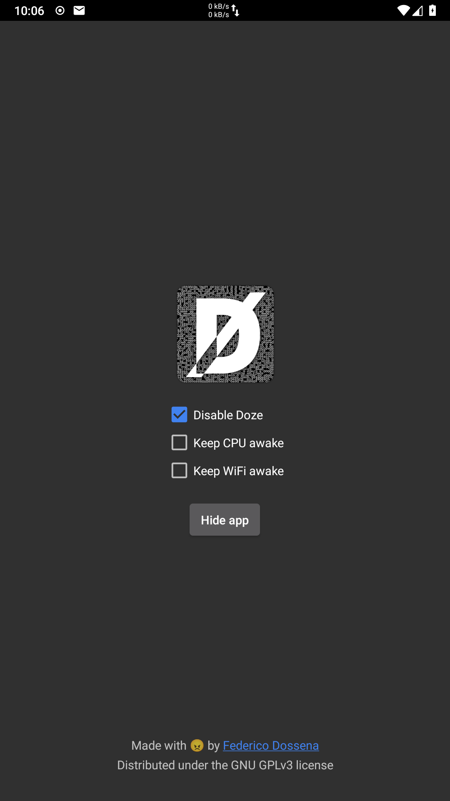

# DozeOff
**Root required!**

Since Doze was introduced in Android 6.0, it's been a constant source of pain for developers who can't keep background processes running reliably, and users who are constantly missing important notifications because the system automatically decides to kill background services. Some ROMs are worse than others, with MIUI being the worst offender and AOSP being somewhat tolerable.

DozeOff automatically disables Doze when the system is booted on your rooted device, simple as that. There are no settings to tweak, you just install it and forget about it.

## Download
[Download APK](https://downloads.fdossena.com/geth.php?r=dozeoff-apk)

Coming at some point to F-Droid.

## Supported devices
Any **rooted** device running Android 6.0 and newer.  
Tested on LineageOS 17.1

## Donate
[Donate with PayPal](https://www.paypal.me/sineisochronic)

## Screenshots

## License
Copyright (C) 2020 Federico Dossena

This program is free software: you can redistribute it and/or modify
it under the terms of the GNU General Public License as published by
the Free Software Foundation, either version 3 of the License, or
(at your option) any later version.

This program is distributed in the hope that it will be useful,
but WITHOUT ANY WARRANTY; without even the implied warranty of
MERCHANTABILITY or FITNESS FOR A PARTICULAR PURPOSE.  See the
GNU General Public License for more details.

You should have received a copy of the GNU General Public License
along with this program.  If not, see <http://www.gnu.org/licenses/>.

AirPods is a trademark of Apple inc.
